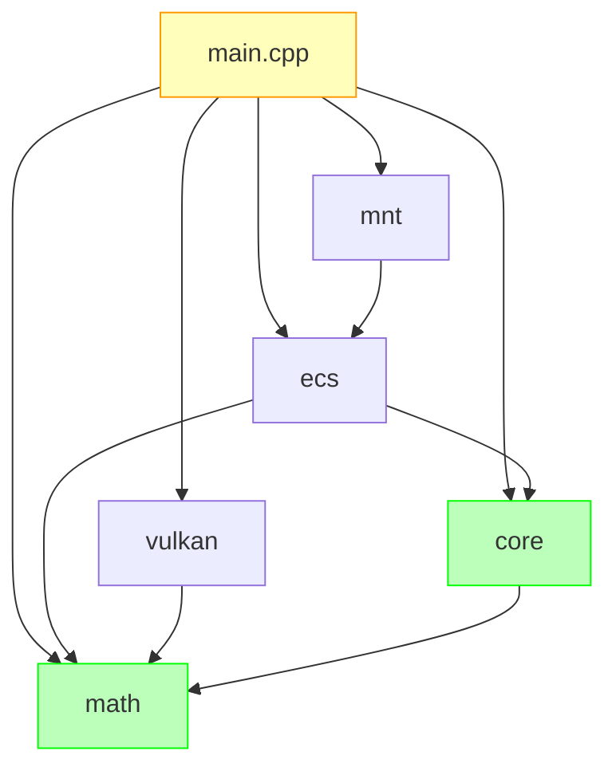
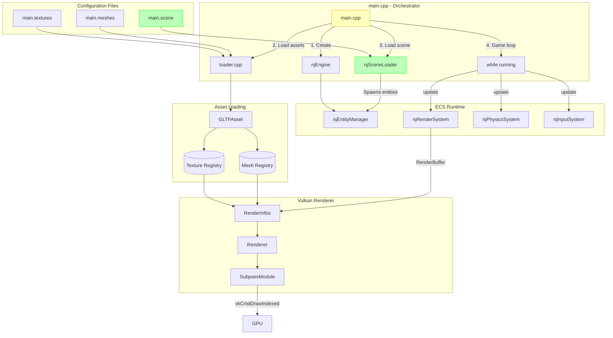
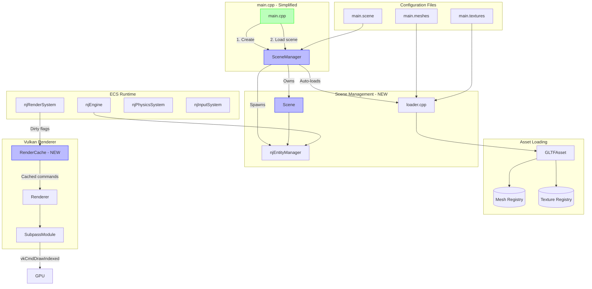

# Architecture Review & Critique

**Date:** 03 February 2026 | **Version:** v0.6.6 | **First Commit:** 959bd0f

## Table of Contents

- [0. Executive Summary](#0-executive-summary)
- [1. What Was Preserved](#1-what-was-preserved)
  - [1.1 ECS Framework](#11-ecs-framework)
  - [1.2 Config-Driven Vulkan](#12-config-driven-vulkan)
  - [1.3 Registry Pattern](#13-registry-pattern)
  - [1.4 Module Separation](#14-module-separation)
  - [1.5 Matrix Convention](#15-matrix-convention)
  - [1.6 Core Data Layer Stability](#16-core-data-layer-stability)
- [2. What Was Changed](#2-what-was-changed)
  - [2.1 Code Hotspots](#21-code-hotspots-most-changed)
  - [2.2 New Additions](#22-new-additions)
  - [2.3 Modifications](#23-modifications)
  - [2.4 Dropped/Deprecated](#24-droppeddeprecated)
  - [2.5 Unused Code](#25-unused-code)
- [3. Current Architecture](#3-current-architecture)
  - [3.1 Architecture Diagram](#31-architecture-diagram)
  - [3.2 Module Dependencies](#32-module-dependencies)
  - [3.3 Data Flow (Current v0.6.3)](#33-data-flow-current-v063)
  - [3.4 Core vs ECS Split](#34-core-vs-ecs-split)
- [4. Technical Debt](#4-technical-debt)
- [5. Feature Roadmap](#5-feature-roadmap)
- [6. Proposed Architecture Changes](#6-proposed-architecture-changes)
  - [6.1 SSBO Refactor (P1)](#61-ssbo-refactor-p1)
  - [6.2 Physics Module Extraction (P5)](#62-physics-module-extraction-p5)
  - [6.3 SceneManager / RenderCache](#63-scenemanager--rendercache)
  - [6.4 Future Data Flow Diagram](#64-future-data-flow-diagram)
- [Appendix](#appendix)
  - [A. Descriptor Architecture Deep Dive](#a-descriptor-architecture-deep-dive)
  - [B. Dropped Classes Deliberation](#b-dropped-classes-deliberation)

---

## 0. Executive Summary

njin evolved to current v0.6.6 while **preserving the original core architecture** (ECS framework, config-driven Vulkan, registry pattern). Key additions include data-driven scene loading (`njSceneLoader`), indexed drawing support (`IndexBuffers`), and physics integration. The data layer (`njMesh`, `njPrimitive`, `njVertex`) remains stable since commit 1.

---

## 1. What Was Preserved

### 1.1 ECS Framework

Template-based compile-time archetype classification with zero runtime overhead. Flexible `Include<>/Exclude<>` queries for entity filtering.

### 1.2 Config-Driven Vulkan

`config.h` remains the single source of truth for pipeline configuration. Named resource management and explicit vertex layouts are unchanged.

### 1.3 Registry Pattern

Dual-access pattern (by name + by index) for clean asset management. The v0.5 namespacing fix handles multi-asset GLTF loading (`{alias}-{meshName}`).

### 1.4 Module Separation

ECS makes zero Vulkan calls. It populates a platform-agnostic `RenderBuffer` which is consumed by the Vulkan layer. This separation allows future renderer backends.

### 1.5 Matrix Convention

The engine uses **row-major** matrices with **row vectors** (`v * M`):

| Context | Convention | Notes |
|:--------|:-----------|:------|
| `njMat4` storage | Row-major | `data_[row][col]` |
| Vector multiplication | Row-vector | `vec * mat` |
| Shader uniform | Transposed at upload | `glm::transpose` equivalent |
| GLTF import | Column→Row transpose | Fixed in v0.6.1 |

This has been stable since the initial commit. Changing it would require shader rewrites.

### 1.6 Core Data Layer Stability

| Layer | Purpose | Stability | Key Types |
|:------|:--------|:----------|:----------|
| **Core** (`njin/core`) | Pure data structures, no logic | 🧊 Very stable | `njMesh`, `njPrimitive`, `njVertex`, `njRegistry` |
| **ECS** (`njin/ecs`) | Logic, systems, entity management | 🔥 Active development | `njRenderSystem`, `njSceneLoader`, `njEntityManager` |

**Design Principle:** Core types are "dumb" data containers that can be serialized, inspected, and passed between systems. ECS owns all behavior and mutation. This separation allows the Vulkan layer to depend on Core without pulling in ECS logic.

---

## 2. What Was Changed

### 2.1 Code Hotspots (Most Changed)

| Heat | Path | Changes | Why |
|:----:|:-----|:--------|:----|
| 🔥🔥🔥 | `njin/util/src/GLTFAsset.cpp` | 671 lines, complete rewrite | Hierarchy, materials, baking |
| 🔥🔥 | `njin/ecs/src/njRenderSystem.cpp` | ~300 lines | Scale support, hierarchy traversal |
| 🔥🔥 | `njin/ecs/src/njSceneLoader.cpp` | 246 lines (new) | Data-driven scene loading |
| 🔥 | `njin/vulkan/src/SubpassModule.cpp` | Indexed drawing | `vkCmdDraw` → `vkCmdDrawIndexed` |
| 🔥 | `shader/shader.frag` | Lighting rewrites | Double gamma, rim lighting fixes |
| 🧊 | `njin/core/*` | Minimal | Stable data foundation |
| 🧊 | `njin/vulkan/config.h` | One-time setup | Pipeline configuration |

### 2.2 New Additions

| Addition | Location | Purpose |
|:---------|:---------|:--------|
| `njSceneLoader` | `ecs/src/njSceneLoader.cpp` (246 lines) | Data-driven scene loading from JSON |
| `IndexBuffers` | `vulkan/` | Indexed drawing support for `vkCmdDrawIndexed` |
| Physics System | `ecs/physics/` | BVH, collision detection, `njPhysicsSystem` |
| GLTF Hierarchy Baking | `util/src/GLTFAsset.cpp` | Transforms baked at load time |

### 2.3 Modifications

#### `njPrimitive` — Fundamental Redesign

| Aspect | Original | Current | Impact |
|:-------|:---------|:--------|:-------|
| **Definition** | A single triangle (`std::array<njVertex, 3>`) | An indexed mesh (`vector<njVertex>` + `vector<uint32_t>`) | Enables indexed drawing |
| **Indices** | Implicit (3 vertices = 1 triangle) | Explicit `indices_` member | Required for `vkCmdDrawIndexed` |
| **Materials** | None | `material_name_` member | Supports PBR materials |

```cpp
// Current njPrimitive.h
class njPrimitive {
    std::vector<njVertex> vertices_;
    std::vector<uint32_t> indices_;  // NEW
    std::string material_name_;      // NEW
};
```

**Consequence:** Every primitive now requires indices. The Vulkan layer (`IndexBuffers`, `SubpassModule`) was updated to bind and draw indexed geometry. See `enhancement-3.md` for the full debugging saga.

#### `njMesh` — Minor Updates

| Change | Before | After |
|:-------|:-------|:------|
| `name` field | None | Public `std::string name` |
| Constructor | Primitives only | Primitives + name |
| `get_vertex_count()` | Direct access | Iterates over new primitive structure |

#### `GLTFAsset` Rewrite

671 lines, complete rewrite to support hierarchy baking, materials, multi-primitive meshes. See Code Hotspots.

### 2.4 Dropped/Deprecated

#### `MeshBuilder` — Obsolete Factory Pattern

| Attribute | Value |
|:----------|:------|
| **Location** | `core/MeshBuilder.h`, `core/MeshBuilder.cpp` |
| **Status** | 🗑️ Excluded from build (files still exist) |
| **Replaced By** | `GLTFAsset::get_meshes()` |

**What it was:**
`MeshBuilder` was an intermediate factory for constructing meshes from separate attribute arrays (positions, normals, UVs). The intent was to abstract mesh construction from file format parsing.

```cpp
// OLD Pattern
MeshBuilder builder(indices);
builder.add_position_attributes(positions);
builder.add_normal_attributes(normals);
builder.add_uv_attributes(uvs);
njMesh mesh = builder.build();
```

**Why it was dropped:**

| Consideration | Deliberation |
|:--------------|:-------------|
| **Redundancy** | Once `GLTFAsset` became the primary mesh source, having a separate builder added an extra abstraction layer with no benefit. |
| **Self-Contained Loader** | Modern design prefers loaders that directly produce ready-to-use data structures. The loader owns the parsing AND construction. |
| **Maintenance Burden** | Keeping `MeshBuilder` in sync with evolving `njPrimitive` (indices, materials) added friction. |

**Alternative Considered:**
Keep `MeshBuilder` for procedural mesh generation (e.g., `RoomBuilder` floor tiles).

**Decision:**
Procedural generation can directly construct `njPrimitive` vectors without an intermediate builder. The abstraction cost wasn't justified.

**Cleanup Action:** Files can be safely deleted from `njin/core/`.

---

#### `njSceneReader` — Never Fully Implemented

| Attribute | Value |
|:----------|:------|
| **Location** | Originally in `core/` (exact location unclear) |
| **Status** | 🗑️ Never completed / Rebuilt as `njSceneLoader` |
| **Replaced By** | `njSceneLoader` (in `ecs/`) |

**What it was intended to be:**
`njSceneReader` was designed in the first commit to parse `scene.schema.json` files and populate a scene graph with `njObject` instances. The schema still exists.

**What actually happened:**

| Consideration | Deliberation |
|:--------------|:-------------|
| **Never Completed** | The class was either never fully implemented or got lost during rapid development. When data-driven scenes were needed later, the functionality simply wasn't there. |
| **Wrong Layer Anyway** | A `core/` class shouldn't spawn ECS entities or know about archetypes. This would have caused circular dependency issues. |
| **Practical Bypass** | During active development, hardcoding entity creation in `main.cpp` was faster than building the scene loader infrastructure. |

**Rebuild Decision:**
Rather than revive `njSceneReader` in `core`, `njSceneLoader` was built in `ecs/`:
- Lives in the correct layer (ECS knows about archetypes)
- Uses `rapidjson` for JSON parsing (same as the original intent)
- Spawns entities via archetype factories (`njPlayerArchetype`, `njObjectArchetype`)

**Alternative Considered: Revive in `core/` with Callbacks**

The Jan 30 roadmap initially listed "P3: Revive/refactor `njSceneReader`" as an option. This would have kept the reader in `core/` and used factory callbacks to avoid the circular dependency:

```cpp
// Hypothetical pattern (NOT implemented)
njSceneReader reader("main.scene");
reader.set_entity_factory([&](const SceneNode& node) {
    // ECS layer provides the factory via callback
    return archetype.create(engine, node);
});
```

**Why rebuild was chosen over revive:**

| Revive in `core/` | Rebuild in `ecs/` |
|:------------------|:------------------|
| Requires callback/factory injection | Direct archetype access |
| Complex wiring in `main.cpp` | Clean single-file implementation |
| Maintains "purity" of core layer | Accepts that scene loading is ECS-aware |

The consensus was that scene loading is inherently an ECS concern (it spawns entities with components), so placing `njSceneLoader` in `ecs/` is architecturally cleaner than forcing `core/` to remain agnostic via callbacks.

**Schema Note:**
The original `scene.schema.json` still exists and could be used for validation, but `njSceneLoader` currently doesn't validate against it (P2 technical debt).

---

### 2.5 Unused Code

#### `njObject` — OO Scene Node Superseded

| Attribute | Value |
|:----------|:------|
| **Location** | `runtime/njObject.h` |
| **Status** | 🔇 Superseded (still exists in dormant `runtime/` module) |
| **Current Alternative** | `EntityId` + Components |

**What it was:**
`njObject` was the original OO scene node class:

```cpp
class njObject {
    std::vector<njObject*> children_;  // Hierarchy
    njMesh* mesh_;                      // Renderable data
    njMat4 transform_;                  // Local transform
    njObject* parent_;                  // Parent pointer
};
```

**Why it is not used:**

| Consideration | Deliberation |
|:--------------|:-------------|
| **Cache Locality** | OO hierarchy with pointers causes cache misses during traversal. ECS stores components contiguously. |
| **Separation of Concerns** | `njObject` owned transform, mesh reference, AND hierarchy. ECS separates these into `njTransformComponent`, `njMeshComponent`, etc. |
| **Query Flexibility** | ECS allows queries like "all entities with physics but no mesh" which OO hierarchy cannot express naturally. |
| **Render System Simplification** | Without parent-child relationships, `njRenderSystem` iterates a flat array instead of recursively traversing. |

**Alternative Considered:**
Keep `njObject` for runtime hierarchy (animations, parent-child transforms).

**What Was Lost:**
- Runtime parent-child relationships (required for skeletal animation)
- Dynamic hierarchy manipulation

**Decision:**
For static geometry, the current model is sufficient. The "bake transforms at load time" strategy compensates for the lack of runtime hierarchy. Skeletal animation will require revisiting this decision (see Feature Roadmap).

---

#### `runtime/` Module

| Module | Path | Status | Contents |
|:-------|:-----|:-------|:---------|
| `runtime` | `njin/runtime/` | 🔇 Dormant | `njLevel`, `njBuffer` — original OO infrastructure |

Not integrated into current engine. Decision needed: revive with ECS integration or remove.

---

#### `mnt/` Module

| Module | Path | Status | Contents |
|:-------|:-----|:-------|:---------|
| `mnt` | `njin/mnt/` | ⚠️ **Broken** | `RoomBuilder` — procedural generation |

---

#### `RoomBuilder` — Broken Mesh References

`RoomBuilder` is commented out in `main.cpp` and **would not work** even if re-enabled:

```cpp
// mnt/src/RoomBuilder.cpp
.mesh = "cube"  // ❌ Wrong: registry uses "cube-Object_0"
```

The loader registers meshes as `"{alias}-{gltfMeshName}"` (e.g., `"cube-Object_0"`), but `RoomBuilder` uses bare aliases. This mismatch means `njRenderSystem` would find no mesh.

**To fix:** Either:
1. Update `RoomBuilder` to use `mesh_registry.get_primary_mesh_name("cube")`
2. Or delete if procedural generation is no longer in scope

**Decision Needed:** Either revive these modules with proper ECS integration or remove them to reduce confusion.

---


## 3. Current Architecture

### 3.1 Architecture Diagram

```
┌─────────────────────────────────────────────────────────────┐
│                        main.scene                           │
│                     (Data-Driven JSON)                      │
└─────────────────────┬───────────────────────────────────────┘
                      │ njSceneLoader
                      ▼
┌─────────────────────────────────────────────────────────────┐
│                    ECS Layer                                │
│  ┌──────────────┐ ┌──────────────┐ ┌──────────────┐        │
│  │njRenderSystem│ │njPhysicsSystem│ │njInputSystem│        │
│  └──────┬───────┘ └──────────────┘ └──────────────┘        │
│         │                                                   │
│         ▼ RenderBuffer                                      │
└─────────┬───────────────────────────────────────────────────┘
          │
┌─────────▼───────────────────────────────────────────────────┐
│                   Vulkan Layer                              │
│  RenderInfos → IndexBuffers/VertexBuffers → SubpassModule   │
│                          ↓                                  │
│                  vkCmdDrawIndexed                           │
└─────────────────────────────────────────────────────────────┘
```

### 3.2 Module Dependencies



**Rules:**
- `core` never imports from `ecs` or `vulkan`
- `ecs` imports from `core` and `math`
- `vulkan` imports from `math` only (receives core data via `main.cpp` pointers, not direct includes)
- `mnt` imports from `ecs` (for archetypes)
- `main.cpp` is the composition root — bridges all layers by passing pointers/references

---

### 3.3 Data Flow (Current v0.6.3)



**main.cpp orchestration sequence:**
1. Create `njEngine` (SDL window, Vulkan context)
2. Load assets via `loader.cpp` → populates registries
3. Load scene via `njSceneLoader` → spawns entities from JSON
4. Enter game loop → systems update each frame

---

### 3.4 Core vs ECS Split

The original design (commit 959bd0f) included an **Object-Oriented scene graph**:

```
njObject (owns children[], mesh, transform)
    └── njMesh → njPrimitive → njVertex
```

The engine as it exists today uses a **strict ECS** while preserving the data layer:

| Layer | Original (OO) | Current (ECS) | Status |
|:------|:--------------|:--------------|:------:|
| **Identity** | `class njObject` | `EntityId` (uint32) | Different approach |
| **Composition** | Object holds mesh | `njMeshComponent` | Preserved |
| **Transform** | Member variable | `njTransformComponent` | Preserved |
| **Hierarchy** | `vector<njObject>` | `njParentComponent` | Logic preserved |
| **Scene Loading** | `njSceneReader` | `njSceneLoader` | Rebuilt |
| **Data Layer** | `njMesh/Vertex` | `njMesh/Vertex` | **Identical** |

> **Note:** The data layer has been stable since commit 1. ECS provides cache locality and separation of concerns.

---

## 4. Technical Debt

| Priority | Issue | Risk | Location | Fix |
|:--------:|:------|:-----|:---------|:----|
| **P0** | ~~16 object limit~~ | ✅ Fixed v0.6 | `config.h` | Raised to 1024 |
| **P2** | No JSON schema validation | 🟠 Crashes on typos | `njSceneLoader.cpp` | Validate against `scene.schema.json` |
| **P3** | Per-frame render rebuild | 🟡 Scale limit | `njRenderSystem.cpp` | Dirty-flag caching |
| **P4** | Entity naming collisions | 🟢 Future risk | `njSceneLoader.cpp:207` | Add unique suffixes |

---

## 5. Feature Roadmap

| Feature | Status | Notes |
|:--------|:------:|:------|
| GLTF Animations & Skinning | 🔮 Future | Requires runtime hierarchy (breaks baking pattern) |
| GLTF Camera Imports | 🔮 Future | Schema exists, not implemented |
| Morph Targets | 🔮 Future | Low priority |

---

## 6. Proposed Architecture Changes

### 6.1 SSBO Refactor

**Problem:** 1024 descriptors breaks macOS/MoltenVK (~31 descriptor limit).

```cpp
// config.h
constexpr int MAX_OBJECTS = 1024;
// Uses 1024 descriptor sets per frame
// Windows/Linux: ✅ Works
// macOS/MoltenVK: ❌ Limit ~31-128 depending on GPU
```

**Fix:** Migrate from per-object descriptor sets to a single SSBO (Shader Storage Buffer Object).

| Metric | Current (Option A) | Target (Option B) |
|:-------|:-------------------|:------------------|
| Windows | ✅ Works | ✅ Would work |
| macOS | ❌ Breaks (>31 limit) | ✅ Would work |
| Descriptor binds/frame | 1024 | 1 |
| Max objects | Compile-time constant | VRAM-limited |

See [Appendix A](#a-descriptor-architecture-deep-dive) for full deliberation.

### 6.2 Physics Module Extraction

**Problem:** Physics algorithms (BVH, collision) are nested in `ecs/physics/` but are general-purpose.

**Current structure:**
```
ecs/
├── physics/          ← Physics engine nested here
│   ├── BVH.cpp
│   └── BVHNode.cpp
└── src/
    └── njPhysicsSystem.cpp  ← System that USES physics
```

**Problems with this:**
1. **Separation of concerns** — The physics engine (BVH, collision detection, ray casting) is a general-purpose algorithm library. It doesn't need to know about ECS entities, components, or systems.
2. **Reusability** — If you wanted to use the physics BVH for non-ECS purposes (e.g., a standalone raytracer, a utility tool), you'd have to pull in the entire `ecs` module.
3. **Conceptual mismatch** — `njPhysicsSystem` is an ECS system (belongs in `ecs`). `BVH` and `BVHNode` are pure algorithms (should be at the `core` or `math` level).

**Proposed structure:**
```
njin/
├── physics/     ← NEW peer module
│   ├── BVH.cpp
│   └── BVHNode.cpp
├── core/
├── math/
└── ecs/
    └── src/
        └── njPhysicsSystem.cpp  ← System imports from physics/
```

Then the dependency would be:
```
ecs --> physics --> math
```

This is similar to how `vulkan` is a sibling module that `main.cpp` combines with `ecs`, rather than `vulkan` being inside `ecs`.

### 6.3 SceneManager / RenderCache

| Component | Purpose |
|:----------|:--------|
| `SceneManager` | Owns scene lifetime, auto-triggers asset loading, handles scene transitions |
| `Scene` | Scoped entity container (unloading a scene removes its entities) |
| `RenderCache` | Caches render commands; only rebuilds on dirty flag (not every frame) |

**Benefits:**
- `main.cpp` becomes trivial (just load scene, run)
- Scene transitions become possible (unload old, load new)
- Performance: dirty-flag rendering instead of per-frame rebuild

### 6.4 Future Data Flow Diagram



**Proposed changes (blue = new):**

| Component | Purpose |
|:----------|:--------|
| `SceneManager` | Owns scene lifetime, auto-triggers asset loading, handles scene transitions |
| `Scene` | Scoped entity container (unloading a scene removes its entities) |
| `RenderCache` | Caches render commands; only rebuilds on dirty flag (not every frame) |

**Benefits:**
- `main.cpp` becomes trivial (just load scene, run)
- Scene transitions become possible (unload old, load new)
- Performance: dirty-flag rendering instead of per-frame rebuild

---

# Appendix

## A. Descriptor Architecture Deep Dive

This section captures the deliberations around our rendering architecture, specifically the tradeoff between **many descriptors** (current) vs **single SSBO** (recommended future).

### The Problem

Support for >16 rendered objects was needed. Two approaches were considered:

### Option A: Descriptor Array (Current — v0.6)

```glsl
// shader.vert
layout(set=0, binding=0) uniform Model { mat4 transform; } models[1024];
```

| Pros | Cons |
|:-----|:-----|
| Simple to implement (just change constants) | **Mac Incompatible** — exceeds `maxPerStageDescriptorStorageBuffers` (~31 on MoltenVK) |
| Works on Windows desktop GPUs | **High overhead** — driver validates 1024 pointers per frame |
| | **Hard limit** — capped at compile-time constant |

### Option B: Single SSBO (Recommended)

```glsl
// shader.vert
layout(std430, set=0, binding=0) buffer Model { 
    mat4 transforms[]; 
} objectData;
// Access via: objectData.transforms[gl_InstanceIndex]
```

| Pros | Cons |
|:-----|:-----|
| **Mac/Mobile compatible** — uses only 1 descriptor | Requires shader rewrite + buffer packing logic |
| **Scalable** — limited only by VRAM (millions of objects) | Requires std430 alignment awareness |
| **Faster** — 1 descriptor bind vs 1024 | |

### Why Does Descriptor Count Affect Performance?

Descriptors are **bookkeeping** for the GPU/Driver:

1. **CPU Overhead ("Death by 1000 cuts")**
   - Option A: Driver validates and updates 1024 pointers every frame
   - Option B: Driver updates 1 base pointer
   
2. **Hardware Limits ("The Wall")**
   - GPUs have ~31 "fast slots" (registers) for bound resources
   - Exceeding this forces descriptor swapping from slow memory
   - **This is why Mac/MoltenVK fails** — Metal's limit maps to ~31 buffers

### Why Not Always Use Single Descriptor?

If fewer is better, why have multiple descriptor sets at all?

1. **Update Frequency Separation**
   - Set 0: Camera/View (updates per-frame)
   - Set 1: Materials (updates rarely)
   - Set 2: Object transforms (updates per-object)
   - Separating avoids rebinding static data when only dynamic data changes

2. **Type Heterogeneity**
   - A 1024×1024 texture and a 256×256 texture cannot live in the same uniform array
   - Different resource types (buffers, samplers, images) need separate descriptors

### Industry Context: Bindless Rendering

Modern engines (Unreal 5, Doom Eternal) use **Bindless Rendering**:
- All textures/buffers are indices into a single giant heap
- Zero per-object descriptor binding
- Option B is a step toward this architecture

### Current Status

| Metric | Option A (Current) | Option B (Target) |
|:-------|:-------------------|:------------------|
| Windows | ✅ Works | ✅ Would work |
| macOS | ❌ Breaks (>31 limit) | ✅ Would work |
| Descriptor binds/frame | 1024 | 1 |
| Max objects | Compile-time constant | VRAM-limited |

**Decision:** Ship v0.6 with Option A for Windows. Transition to Option B before macOS release.

---

## B. Dropped Classes Deliberation

This section provides additional detail on the deliberations behind removing or superseding certain classes.

### MeshBuilder — Full Deliberation

| Consideration | Deliberation |
|:--------------|:-------------|
| **Redundancy** | Once `GLTFAsset` became the primary mesh source, having a separate builder added an extra abstraction layer with no benefit. |
| **Self-Contained Loader** | Modern design prefers loaders that directly produce ready-to-use data structures. The loader owns the parsing AND construction. |
| **Maintenance Burden** | Keeping `MeshBuilder` in sync with evolving `njPrimitive` (indices, materials) added friction. |

**Alternative Considered:** Keep `MeshBuilder` for procedural mesh generation.

**Decision:** Procedural generation can directly construct `njPrimitive` vectors without an intermediate builder. The abstraction cost wasn't justified.

### njObject — Full Deliberation

| Consideration | Deliberation |
|:--------------|:-------------|
| **Cache Locality** | OO hierarchy with pointers causes cache misses during traversal. ECS stores components contiguously. |
| **Separation of Concerns** | `njObject` owned transform, mesh reference, AND hierarchy. ECS separates these into `njTransformComponent`, `njMeshComponent`, etc. |
| **Query Flexibility** | ECS allows queries like "all entities with physics but no mesh" which OO hierarchy cannot express naturally. |
| **Render System Simplification** | Without parent-child relationships, `njRenderSystem` iterates a flat array instead of recursively traversing. |

**What Was Lost:**
- Runtime parent-child relationships (required for skeletal animation)
- Dynamic hierarchy manipulation

**Decision:** For static geometry, the current model is sufficient. Skeletal animation will require revisiting this decision.

### njSceneReader — Full Deliberation

| Consideration | Deliberation |
|:--------------|:-------------|
| **Never Completed** | The class was either never fully implemented or got lost during development. |
| **Wrong Layer** | A `core/` class shouldn't spawn ECS entities — circular dependency risk. |
| **Practical Bypass** | Hardcoding entity creation in `main.cpp` was faster during active development. |

**Alternative Considered: Revive in `core/` with Callbacks**

```cpp
// Hypothetical pattern (NOT implemented)
njSceneReader reader("main.scene");
reader.set_entity_factory([&](const SceneNode& node) {
    return archetype.create(engine, node);
});
```

**Why rebuild was chosen over revive:**

| Revive in `core/` | Rebuild in `ecs/` |
|:------------------|:------------------|
| Requires callback/factory injection | Direct archetype access |
| Complex wiring in `main.cpp` | Clean single-file implementation |
| Maintains "purity" of core layer | Accepts that scene loading is ECS-aware |

Scene loading is inherently an ECS concern (it spawns entities with components), so placing `njSceneLoader` in `ecs/` is architecturally cleaner than forcing `core/` to remain agnostic via callbacks.
