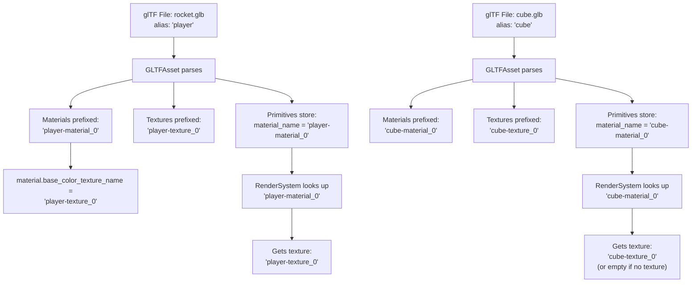

# Material Registry Namespacing Fix - 21 Jan 2026

---

# Implementation Plan

## Problem
When loading multiple glTF files, material indices collide because:
- Meshes are prefixed with alias (e.g., `"cube-Object_0"`, `"player-Cube.001"`)
- Materials are NOT prefixed (both files can have `"material_0"`)
- Primitive stores raw glTF material index, causing cross-file lookups

## Proposed Changes

### 1. Prefix Materials and Textures at Load Time

#### [MODIFY] [loader.cpp](file:///Users/powhweee/coding/njin/njin/core/src/loader.cpp)

```cpp
// Prefix materials with alias
for (const auto& material : asset.get_materials()) {
    std::string qualified_name = name + "-" + material.name;
    njMaterial prefixed_material = material;
    prefixed_material.name = qualified_name;
    material_registry.add(qualified_name, prefixed_material);
}

// Prefix textures with alias
for (const auto& texture : asset.get_textures()) {
    std::string qualified_name = name + "-" + texture.name;
    njTexture prefixed_texture = texture;
    prefixed_texture.name = qualified_name;
    texture_registry.add(qualified_name, prefixed_texture);
}
```

---

### 2. Store Material Name in Primitive (not index)

#### [MODIFY] [njPrimitive.h](file:///Users/powhweee/coding/njin/njin/core/include/core/njPrimitive.h)

Change from storing `uint32_t material_index` to `std::string material_name`.

#### [MODIFY] [GLTFAsset.cpp](file:///Users/powhweee/coding/njin/njin/util/src/GLTFAsset.cpp)

When creating primitive, resolve material index to prefixed name using the alias.

---

### 3. Update Render System

#### [MODIFY] [njRenderSystem.cpp](file:///Users/powhweee/coding/njin/njin/ecs/src/njRenderSystem.cpp)

Look up material by name instead of index:
```cpp
std::string material_name = primitive.get_material_name();
const auto* material = material_registry_->get(material_name);
if (material && material->base_color_texture_index != -1) {
    // texture lookup
}
```

## Verification
- Prism should render as plain gray (no texture)
- Rocket should render with its texture

---

# Walkthrough

## Problem Solved
When loading multiple glTF files, material indices collided because:
- Meshes were prefixed with alias (e.g., `"cube-Object_0"`, `"player-Cube.001"`)
- Materials were NOT prefixed (both files could have `"material_0"`)
- Primitives stored raw glTF material index, causing cross-file lookups

## Solution
Changed from **index-based** to **name-based** material and texture lookup, with all names prefixed by asset alias at load time.

---

## Files Modified

### Core Data Structures

#### [njPrimitive.h](file:///Users/powhweee/coding/njin/njin/core/include/core/njPrimitive.h)
- Changed `uint32_t material_index_` → `std::string material_name_`
- Changed `get_material_index()` → `get_material_name()`

#### [njPrimitive.cpp](file:///Users/powhweee/coding/njin/njin/core/src/njPrimitive.cpp)
- Updated implementation to match header changes

#### [njMaterial.h](file:///Users/powhweee/coding/njin/njin/core/include/core/njMaterial.h)
- Changed `int base_color_texture_index` → `std::string base_color_texture_name`

---

### Asset Loading

#### [GLTFAsset.h](file:///Users/powhweee/coding/njin/njin/util/include/util/GLTFAsset.h)
- Added `alias` parameter to constructor
- Added `alias_` member variable

#### [GLTFAsset.cpp](file:///Users/powhweee/coding/njin/njin/util/src/GLTFAsset.cpp)
- Constructor now accepts and stores alias
- Added `TempMaterial` struct to hold texture index temporarily
- Prefixes all material and texture names with alias
- Resolves texture indices to prefixed texture names
- Primitives now store prefixed material names

#### [loader.cpp](file:///Users/powhweee/coding/njin/njin/core/src/loader.cpp)
- Passes asset `name` (alias) to `GLTFAsset` constructor
- Added logging for registered materials and textures

---

### Rendering

#### [njRenderSystem.cpp](file:///Users/powhweee/coding/njin/njin/ecs/src/njRenderSystem.cpp)
- Changed from index-based material lookup to name-based
- Uses `primitive.get_material_name()` to get prefixed material name
- Uses `material->base_color_texture_name` directly for texture lookup

---

## Data Flow (After Fix)



---

## Expected Verification
After building and running:
- **Prism/Cube** should render as plain gray (no texture, using vertex colors)
- **Rocket/Player** should render with its correct texture
- Console should show prefixed registry keys:
  ```
  Registered mesh: player-Cube.001
  Registered material: player-material_0
  Registered texture: player-texture_0
  Registered mesh: cube-Object_0
  Registered material: cube-material_0
  ```
