# njin Architecture Critique

**Author:** Claude (Anthropic)  
**Date:** 30 January 2026  
**Current Version:** v0.5.1

---

## Executive Summary

**njin** is a custom ECS-based game engine written in C++ with a Vulkan renderer. It demonstrates strong foundational principles in its ECS framework, compile-time type safety, and configuration-driven rendering. However, the codebase has accumulated technical debt as rapid feature development (glTF loading, material namespacing, indexed drawing) has outpaced architectural refinement.

The **original architectural intent** was data-driven scene composition via `njSceneReader` and `scene.schema.json`. This vision has been **bypassed** in favor of hardcoded entity creation in `main.cpp`, creating a coupling between asset configuration and application code.

---

## Original Architectural Intent

From the **first commit (959bd0f)**, the engine was designed with a data-driven architecture:

| Component | Purpose |
|-----------|---------|
| `njSceneReader` | Load scenes from external JSON config files |
| `njScene` | Runtime scene representation with node hierarchy |
| `njNode` | Scene graph nodes with parent-child relationships |
| `scene.schema.json` | JSON schema defining scene structure |

### Original Scene Schema Design

```json
{
  "nodes": [
    { "name": "player", "transform": [...], "parent": "root" }
  ],
  "meshes": [
    { "mesh": "rocket", "node": "player" }  // ← Data-driven mesh-to-node binding!
  ],
  "cameras": [
    { "name": "main_camera", "node": "camera_node" }
  ]
}
```

**This design would have completely decoupled mesh names from application code.**

---

## Current State Analysis

### What Works Well ✅

1. **ECS Framework Design**
   - Template-based compile-time archetype classification
   - Zero runtime overhead for signature resolution
   - Flexible `Include<>/Exclude<>` queries
   - Clean separation between Component (lightweight ECS data) and Asset (heavy data)

2. **Configuration-Driven Vulkan Pipeline** (`config.h`)
   - Single source of truth for pipeline configuration
   - Named resource management reduces consistency bugs
   - Explicit vertex layouts prevent padding surprises
   - Attachment references by name, not raw indices

3. **Registry Pattern**
   - Dual-access (name and index based lookups)
   - Clean asset management with template generics
   - Recent namespacing fix (v0.5) properly handles multi-asset loading

4. **Design Patterns Documentation**
   - The 37 documented patterns in `engine_patterns.md` are excellent institutional knowledge
   - Clear patterns like "CreateInfo Struct", "Frames in Flight", "Identity-First Matrix Initialization"

---

### What Needs Improvement ⚠️

#### 1. **Hardcoded Mesh Names in `main.cpp`**

**Problem:** Lines like this create coupling between asset manifests and application code:
```cpp
.mesh = { .mesh = "cube-Object_0", .texture_override = "" }
```

**Impact:**
- Changing an alias in `main.meshes` (e.g., `"cube"` → `"rocket"`) requires code changes
- Internal glTF mesh names (like `"Object_0"`, `"Cube.001"`) leak into application logic
- Adding new models requires recompilation

**Root Cause:** The `njSceneReader` and scene-based loading was never integrated/maintained.

**Recommended Refactor:**
```cpp
// Current (bad)
.mesh = { .mesh = "cube-Object_0", ...}

// Better (use alias only, auto-discover mesh)
.mesh = { .mesh = mesh_registry.get_primary_mesh_name("cube"), ...}

// Best (fully data-driven via scene file)
// Scene.json: { "entity": "car", "mesh_alias": "cube", "transform": [...] }
```

---

#### 2. **Dual Configuration Points: `main.meshes` + `main.cpp`**

**Problem:** Asset configuration is split between:
- `main.meshes` - defines what assets to load (alias → glTF file)
- `main.cpp` - defines what entities to create (hardcoded mesh references)

**Impact:**
- No single source of truth for scene composition
- Fragile synchronization between configuration and code

**Recommended Refactor:** Revive `njSceneReader` or create a `main.scene` configuration:

```json
{
  "entities": [
    {
      "name": "player",
      "archetype": "njPlayerArchetype",
      "mesh_alias": "player",
      "transform": { "position": [0, 1, 0] },
      "physics": { "mass": 1.0, "type": "dynamic" }
    },
    {
      "name": "environment",
      "archetype": "njObjectArchetype", 
      "mesh_alias": "cube",
      "transform": { "position": [5, 0, 0] }
    }
  ]
}
```

---

#### 3. **Tight Coupling in Render Pipeline**

**Problem:** The data flow from `njRenderSystem` → `RenderInfos` → `SubpassModule` passes full mesh/material data through multiple transformation layers.

```
ECS Layer → RenderBuffer → RenderInfos → VertexBuffers → SubpassModule → Draw
```

**Impact:**
- `RenderInfos` recreates vertex/index data every frame
- No render object caching or instancing preparation
- Difficult to add new render features (shadows, post-processing) without touching many files

**Recommended Refactor:**
- Introduce a `RenderableCache` that persists between frames
- Separate static geometry upload from per-frame updates
- Consider a render graph abstraction for multi-pass rendering

---

#### 4. **Missing Abstraction: Scene/Level Concept**

**Problem:** There's no high-level "Scene" or "Level" abstraction that owns:
- Entity lifetime management
- Asset loading scope
- Camera and lighting configuration

**Impact:**
- All entities live in a flat global space
- No concept of loading/unloading scenes
- Hard to implement level streaming or scene transitions

**Recommended Refactor:**
- Revive `njScene` and `njNode` classes
- Create `SceneManager` to handle scene loading, unloading, transitions
- Associate registries with scenes for scoped asset management

---

#### 5. **Inconsistent File Organization**

**Problem:** Root directory contains mixed concerns:
- `21-jan-2026-impl.md` (should be in `working-logs/`)
- `Asset Representation.drawio` (could be in `docs/` or `schema/`)
- `main.meshes`, `main.textures` (configuration files mixed with source)

**Impact:**
- Noisy project root
- Harder to find relevant files

**Recommended Refactor:**
```
njin/
├── config/
│   ├── main.meshes
│   ├── main.textures
│   └── main.scene (new)
├── docs/
│   └── architecture/
│       ├── Asset Representation.drawio
│       └── Render.drawio
├── working-logs/
└── ...
```

---

#### 6. **Magic Numbers and Hardcoded Limits**

**Problem:** Scattered constants like:
```cpp
constexpr int MAX_OBJECTS = 16;
.descriptor_count = 16,
```

**Impact:**
- Hard to scale beyond 16 objects/textures
- Limits not documented or validated at runtime

**Recommended Refactor:**
- Centralize limits in a `Limits.h`
- Add runtime validation with clear error messages
- Consider dynamic descriptor set sizing

---

#### 7. **Dead Code: `njSceneReader`, `njScene`, `njNode`**

**Problem:** From the first commit, these classes existed but appear unused in current `main.cpp`.

**Impact:**
- Confusing presence of unused code
- Lost architectural investment

**Recommended Refactor:** Either:
- **Delete** if no longer relevant to vision
- **Revive** and integrate for data-driven scenes

---

## Priority Refactoring Roadmap

| Priority | Refactor | Effort | Impact |
|----------|----------|--------|--------|
| **P0** | Move `21-jan-2026-impl.md` to `working-logs/` | Low | Clean root |
| **P1** | Add `get_primary_mesh_name()` usage everywhere | Low | Reduces hardcoding |
| **P2** | Create `main.scene` configuration | Medium | Data-driven entities |
| **P3** | Revive/refactor `njSceneReader` | Medium | Full scene loading |
| **P4** | Introduce `SceneManager` class | High | Scene lifecycle |
| **P5** | Add render object caching | High | Performance |

---

## Data Flow Diagram: Current Architecture

```mermaid
flowchart TD
    subgraph "Configuration Layer"
        MM[main.meshes]
        MT[main.textures]
    end

    subgraph "Asset Layer"
        LDR[loader.cpp]
        GLTF[GLTFAsset]
        MR[(Mesh Registry)]
        MAR[(Material Registry)]
        TR[(Texture Registry)]
    end

    subgraph "Application Layer"
        MAIN[main.cpp]
        ENG[njEngine]
        EM[njEntityManager]
    end

    subgraph "ECS Systems Layer"
        RS[njRenderSystem]
        IS[njInputSystem]
        PS[njPhysicsSystem]
    end

    subgraph "Vulkan Layer"
        RES[RenderResources]
        RI[RenderInfos]
        RND[Renderer]
        SM[SubpassModule]
    end

    MM --> LDR
    MT --> LDR
    LDR --> GLTF
    GLTF --> MR
    GLTF --> MAR
    GLTF --> TR

    MAIN -->|"Hardcoded mesh names 😬"| ENG
    ENG --> EM
    EM --> RS
    EM --> IS
    EM --> PS

    RS --> |RenderBuffer| RI
    MR --> RI
    TR --> RI
    RI --> RND
    RND --> SM
    RES --> RND

    style MAIN fill:#fbb,stroke:#f00
```



---

## Data Flow Diagram: Proposed Architecture


---

## Conclusion

**njin** has solid foundations in its ECS architecture, configuration-driven Vulkan pipeline, and clearly documented design patterns. The primary architectural drift is the **abandonment of data-driven scene loading** in favor of hardcoded entity creation.

The recommended path forward:
1. **Short term:** Use `get_primary_mesh_name()` to reduce hardcoded mesh string literals
2. **Medium term:** Introduce a `main.scene` configuration for entity definitions
3. **Long term:** Revive and mature the scene graph architecture for proper level management

This will restore the original architectural vision while supporting the features that have been added during development.
